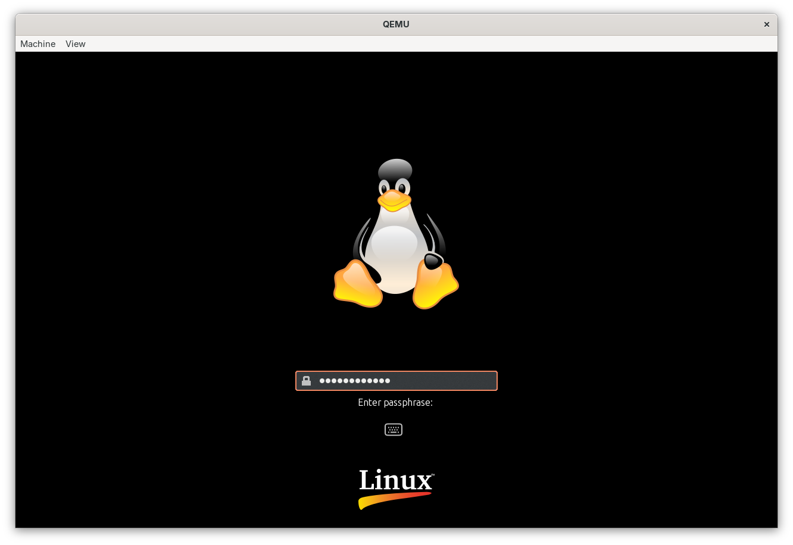

# 🍰 sflc-boot

A Dracut module to boot into hidden OSes on a Shufflecake-formatted partition, as well as Dockerfiles to install supporting OSes based on various distros.

<p align="center">

</p>
<h6 align="center">A screengrab of the initrd built in the <a href="https://github.com/sidstuff/sflc-boot?tab=readme-ov-file#%E2%80%8D-testing">Testing</a> section</h6>

<details>

<summary>&nbsp;<b>💭 About Shufflecake</b></summary><br>

* **What is Shufflecake?**

Shufflecake ([website](https://shufflecake.net/), [repo](https://codeberg.org/shufflecake/shufflecake-c)) is a disk encryption program for Linux — developed in 2022 as an EPFL master's thesis [[DOI]](https://doi.org/10.1145/3576915.3623126) project — that aims to provide plausible deniability.

* **What is plausible deniability in encryption?**

[Deniable encryption](https://en.wikipedia.org/wiki/Deniable_encryption) is similar to steganography — as long as the encrypted header and partition look like random bytes, you can claim that it's simply space that's been erased by overwriting it with random `0`s and `1`s. Even given that there exists some encrypted data, you can deny your ability to decrypt it by claiming to have lost or forgotten the key.

But when the partition in question is large and can be shown to have been used recently, neither of these defenses may be very convincing and could get you accused of destroying/hiding data. In jurisdictions that [mandate key disclosure](https://en.wikipedia.org/wiki/Key_disclosure_law), or in certain illegal cases of coercion ([xkcd](https://xkcd.com/538)), not providing any key at all can result in being labelled uncooperative and facing the legal or illegal consequences of that label.

Shufflecake tries to make the denial plausible by hiding, in the unused space of other volumes, further volumes that are encrypted and look like discarded random bytes. This allows the user to surrender a password that decrypts some (decoy) volumes, but not all — thus avoiding being seen as uncooperative while weakening the prosecution's claim to the arbitrary-sounding `"He provided a password that decrypted M volumes but maybe there are N volumes!!1!1!" 😠`

* **Why should the OS itself be run from a hidden volume?**

From the original paper [[PDF]](https://eprint.iacr.org/2023/1529.pdf):
> [...] the OS itelf (or other applications installed therein) can unintentionally leak to an adversary the presence of hidden data when a hidden volume is unlocked. This can happen for example through the OS logging disk events, search agents indexing files within the hidden volume when this is unlocked, even applications such as image galleries or document readers caching previews of opened documents. Customizing the OS’ behavior in such a way to avoid these pitfalls is an almost hopeless task.  A proposed solution to this problem is to have the OS itself inside a hidden volume.

To facilitate this, we create a custom initramfs containing Shufflecake that can ask for a password and boot into such a hidden OS on start-up.

</details>

> [!IMPORTANT]
> For plausibility, the decoy OSes need to be kept up-to-date by regularly performing system updates, downloading emails, etc.

## ✨ Features

* Thanks to Dracut, the initramfs automatically updates and rebuilds itself when new kernel versions are installed.
* Plymouth and other Dracut modules can be used with it for added functionality.
* Provided are Dockerfiles to perform fresh installs of Ubuntu, Gentoo, and Arch Linux, with the module and its dependencies.
* You can also add the required files and dependencies to an existing install, regenerate the initramfs, and move the root partition into a Shufflecake volume.
* Like the *rd.luks* cmdline parameter for the `crypt` module, you can disable this module using *rd.sflc=0*, or specify the device to unlock by assigning a value to some *rd.sflc.\** identifier.
* If no device is specified, the first device decrypted by the password is used (or if an empty password is supplied, the first unencrypted root device found). The most secret volume opened is always booted into. 

## 📋 TODO

* Test support for alternative CPU architectures
* Add desktop environment options to the Dockerfiles
* Privide a bootable ISO with a GUI installer

## 💻 Usage

To install fresh OSes, ensure you have an existing Linux environment containing Docker (with support for QEMU if trying to build for a different CPU architecture).
```sh
# Use your package manager to install Docker - package name(s) may vary
sudo apt install docker.io docker-buildx # on Debian 𝘧𝘰𝘳𝘬𝘺
sudo usermod -aG docker $USER # add user to the docker group
exec sudo -s -u $USER # refresh groups
docker run --privileged --rm tonistiigi/binfmt --install all # to install QEMU
docker buildx create --bootstrap --use --buildkitd-flags '--allow-insecure-entitlement security.insecure' # insecure flag needed for chroot and mount operations
docker buildx inspect | grep "Platforms" # check the platforms supprted by Docker
# Platforms: linux/amd64, linux/amd64/v2, linux/amd64/v3, linux/386, linux/arm64, linux/riscv64, linux/ppc64le, linux/s390x, linux/mips64le, linux/mips64, linux/loong64, linux/arm/v7, linux/arm/v6
```

Create any of the partitions, that are to be set up as the EFI system partition (ESP) or with hidden OSes, which don't already exist.
> [!TIP]
> To create a simple GPT layout on some disk `/dev/sd𝘟`, where the first 512MiB is the ESP and the remaining space is occupied by the partition to be formatted with Shufflecake, run
> ```sh
> sfdisk /dev/sd𝘟 <<< 'label: gpt
> start=, size=512MiB, type="efi system"
> start=, size=, type="linux reserved"'
> ```

Now use Shufflecake to create and open the hidden volumes that are to contain OSes. Expand the collapsed section for instructions.

<details>

<summary>&nbsp;<b>💾 Volume Creation</b></summary><br>

First, build Shufflecake.
```sh
# Use your package manager to install deps - exact names may vary
sudo apt install git gcc make libgcrypt-dev libdevmapper-dev linux-headers-$(uname -r)
cd ~ && git clone --depth 1 https://codeberg.org/shufflecake/shufflecake-c
cd ~/shufflecake-c && make
```
Stay in the same directory and (after ensuring its dependency `dm_mod` is loaded), insert the module `dm-sflc.ko` into the running kernel.
```sh
sudo modprobe dm_mod
sudo insmod dm-sflc.ko
```
Now you can `init`, `open`, and finally `close`, some Shufflecake volumes `/dev/mapper/sflc_𝘔_𝘕`  on a partition `/dev/sd𝘟𝘠` via
```sh
sudo ./shufflecake 𝘢𝘤𝘵𝘪𝘰𝘯 /dev/sd𝘟𝘠
```

</details>

To build and install a fresh OS:
```sh
cd ~ && git clone https://github.com/sidstuff/sflc-boot
cd ~/sflc-boot
DISTRO="ubuntu" RELEASE="resolute" \
docker buildx bake --set *.platform=amd64 --allow security.insecure
docker buildx bake writer
docker run --rm --privileged -v $PWD:$PWD writer $PWD/images/amd64-ubuntu-questing-esp.iso /dev/𝘌𝘚𝘗
docker run --rm --privileged -v $PWD:$PWD writer $PWD/images/amd64-ubuntu-questing-rootfs.tar.xz --fs="ext4 -b 4096" /dev/mapper/sflc_{𝘮..𝘔}_{𝘯..𝘕}
```

To hide your existing install:
* Ensure it has Shufflecake's dependencies, as well as Dracut, and optionally Plymouth
* Copy `shufflecake-c/` to `/usr/src/` and `70sflc/` to `/usr/lib/dracut/modules.d/`
* Use `add_dracutmodules+=" plymouth sflc "`, `omit_dracutmodules+=" crypt "`, and `kernel_cmdline="quiet splash"`, or similar lines, in [*dracut.conf*](https://dracut-ng.github.io/dracut-ng/man/dracut.conf.5.html)
* Run `dracut -f --regenerate-all`
* Reboot into the initramfs shell (accessed by setting `rd.break=pre-mount`) or another disk containing Shufflecake
* Open a Shufflecake volume and `cat` (or `dd`) the root partition into it, then reboot, and if successful, delete the original partition

<details>

<summary>&nbsp;<h2>🧑‍💻 Testing</h2></summary><br>

For testing during development, you can build just the initrd (done using Ubuntu packages), and specify a kernel version (from any supported distro) that is prebuilt for the target architecture.
```sh
DISTRO="archlinux" KERNEL="6.18.1" SHUFFLECAKE="0.5.7" \
docker buildx bake --set *.platform=amd64 initrd
```
Check the repos for available kernels:
| [Ubuntu](https://kernel.ubuntu.com/mainline) | [Gentoo](https://dev.gentoo.org/~mgorny/binpkg) | [Arch Linux](https://archive.archlinux.org/packages/l/linux) |
|--|--|--|

Also create a Linux disk image.
```
wget https://archive.archlinux.org/iso/2026.02.01/archlinux-bootstrap-x86_64.tar.zst
fallocate -l 800M disk.img
docker buildx bake writer
docker run --rm --privileged -v $PWD:$PWD writer --fs="ext4 -b 4096" $PWD/archlinux-bootstrap-x86_64.tar.zst $PWD/disk.img
```

Then use QEMU to test `sflc-boot` without actually writing to and booting off a pen drive.
```
# Use your package manager to install QEMU - package name may vary
sudo apt install qemu-system
qemu-img create root.img 1G
qemu-system-x86_64 -m 512M -cpu qemu64 \
                   -bios /usr/share/ovmf/OVMF.fd \
                   -kernel images/amd64-archlinux-6.18.1-arch1-2-kernel.img \
                   -initrd images/amd64-archlinux-6.18.1-arch1-2-initrd.img \
                   -append "rd.break=pre-mount" \
                   -drive format=raw,file=disk.img,if=none,cache=writeback,id=stick1 \
                   -drive format=raw,file=root.img,if=none,cache=writeback,id=stick2 \
                   -device qemu-xhci \
                   -device usb-storage,drive=stick1 \
                   -device usb-storage,drive=stick2
```
```
cat /proc/partitions
# major minor  #blocks  name
#    2        0          4 fd0
#   11        0    1048575 sr0
#    8        0    1048576 sda
#    8       16     819200 sdb
modprobe dm_sflc
shufflecake init /dev/sda
shufflecake open /dev/sda
cat /dev/sdb > /dev/dm-0
shufflecake close /dev/sda
```
Then quit QEMU and (after optionally deleting the no longer necessary files) rerun it.
```sh
rm archlinux-bootstrap-x86_64.tar.zst disk.img
qemu-system-x86_64 -m 512M -cpu qemu64 \
                   -bios /usr/share/ovmf/OVMF.fd \
                   -kernel images/amd64-archlinux-6.18.1-arch1-2-kernel.img \
                   -initrd images/amd64-archlinux-6.18.1-arch1-2-initrd.img \
                   -append "quiet splash bgrt_disable" \
                   -drive format=raw,file=root.img,if=none,cache=writeback,id=stick \
                   -device qemu-xhci \
                   -device usb-storage,drive=stick
```

</details>

## Copyright

Copyright © 2025 Sidharth Sankar

The program sflc-boot is part of the Shufflecake Project. Shufflecake is a plausible deniability (hidden storage) layer for Linux. See https://www.shufflecake.net.

This program is free software: you can redistribute it and/or modify it under the terms of the GNU General Public License as published by the Free Software Foundation, either version 2 of the License, or (at your option) any later version. This program is distributed in the hope that it will be useful, but WITHOUT ANY WARRANTY; without even the implied warranty of MERCHANTABILITY or FITNESS FOR A PARTICULAR PURPOSE. See the GNU General Public License for more details. You should have received a copy of the GNU General Public License along with this program. If not, see https://www.gnu.org/licenses/.
